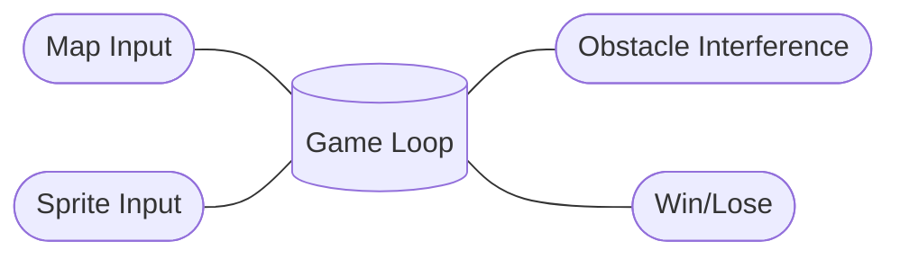

Project Overview
  We are working on a simple RPG, developed in Pico-8, that allows players to explore a medieval world, battle adversaries, avoid death that’s potentially lurking around   every corner, and collect keys to advance through the game.

Key Drivers
  - The biggest driving factor in selecting a design architecture for our project is that it’s a video game. 
  - The player is constantly giving input to the game.
  - The game is constantly reacting to that user input.
  - The game has different options for the player to choose/different branches

Architectural Design Choices
  - Our first choice was a repository architecture. After watching the in-class video on Firewatch, we knew that a repository architecture was a good fit for a game with     many different decisions and branches, including setting flags to true/false. We ultimately decided on this architecture.
  - Our second choice was a client-server architecture. The client-server architecture lends itself well to games in general due to the constant interaction between the     player playing the game and the platform the game is being played on. 

Design Architecture

  In the diagram, the game loop is affected/manipulated by the outside knowledge sources.
  These knowledge sources are things the player can manipulate/change that will affect the blackboard/repository.
  The four main knowledge sources are map input, sprite input, obstacle interference, and win/lose.
  
Overview
  - We chose a repository style design architecture for our project. 
  - Choosing a design architecture can be difficult
  - No issues at this time

