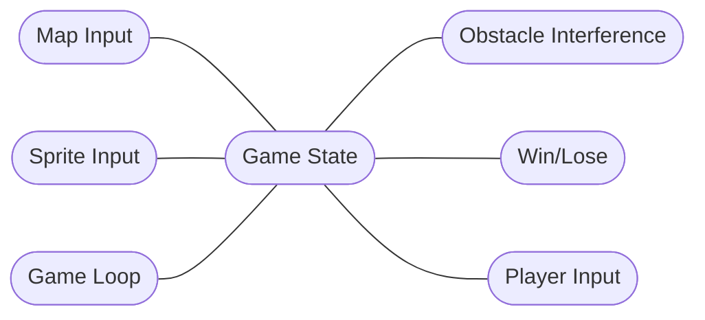

Overview: 

Team Silver Snakes is developing a 2D RPG game using the Pico-8 game engine. Pico-8 is an all inclusive development environment that allows the developer to write the code using Lua, create art assets using a sprite editor within the software and run the code/play the game all within the same window. We intend to allow our player to move around in a medieval like world, fight off monsters, collect items that will aid them on their journey, and defeat a boss that will end the game. We have currently fleshed out core mechanics, and are working on developing the world, building a superficial story, and finishing our win conditions for the game. In the following sections we will describe the class level design structure we have implemented in broad strokes, our design architecture, and a few notes on our unchanging requirements. 

Class Level Design 

Control Issues

As of now there are not control issues, we are able to share and develop the project independently and merge as needed. Debugging takes place on individual branches and is checked before any branch is merged into the master. Only one user commits to the master to avoid confusion or the need to revert to an earlier version. 

Design Architecture -- Repository Model

  In the diagram, the game loop is affected/manipulated by the outside knowledge sources.
  These knowledge sources are things the player can manipulate/change that will affect the blackboard/repository.
  The four main knowledge sources are map input, sprite input, obstacle interference, and win/lose.
  
  KEY CHANGES: 
  We re-thought our understanding of what the core repository is based on feedback. The game state is the core repository that all other components must reference to augment the map environment, control scheme, obstacles or enemies, and if there is a win/lose condition met. 
  
Note on Requirements:

At this stage, our team does not believe there are any major changes needed to requirements. The end result remains the same - a functioning game that allows a user to move around in a 2d environment, interact with the world, fight monsters, and reach a win condition that is still under development. 
