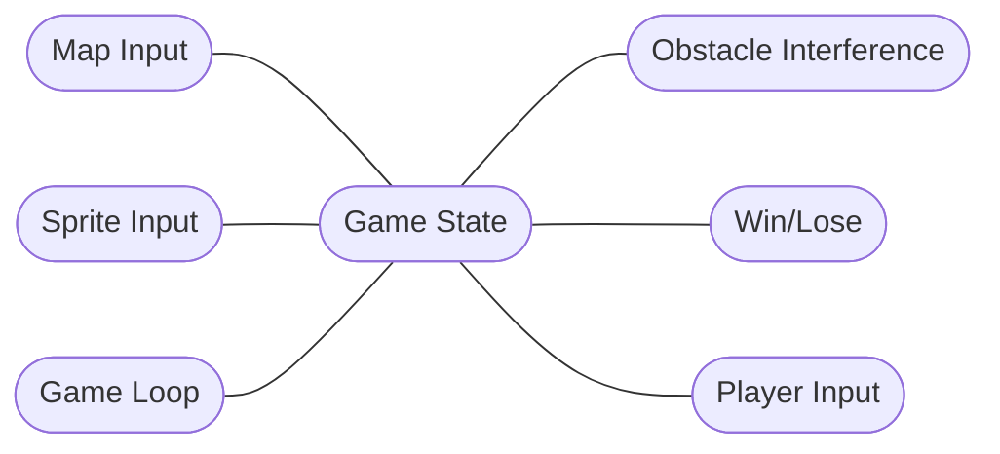

## Welcome to Team Silver Snakes Project Page

# Overview of [Design](https://tai-pan1841.github.io/SilverSnakes/designdocument.md):

Team Silver Snakes is developing a 2D RPG game using the Pico-8 game engine. Pico-8 is an all inclusive development environment that allows the developer to write the code using Lua, create art assets using a sprite editor within the software and run the code/play the game all within the same window. We intend to allow our player to move around in a medieval like world, fight off monsters, collect items that will aid them on their journey, and defeat a boss that will end the game. We have currently fleshed out core mechanics, and are working on developing the world, building a superficial story, and finishing our win conditions for the game. In the following sections we will describe the class level design structure we have implemented in broad strokes, our design architecture, and a few notes on our unchanging requirements. 

# Class Level Design 

# Control Issues

As of now there are not control issues, we are able to share and develop the project independently and merge as needed. Debugging takes place on individual branches and is checked before any branch is merged into the master. Only one user commits to the master to avoid confusion or the need to revert to an earlier version. 

# Design Architecture -- Repository Model

  In the diagram, the game loop is affected/manipulated by the outside knowledge sources.
  These knowledge sources are things the player can manipulate/change that will affect the blackboard/repository.
  The four main knowledge sources are map input, sprite input, obstacle interference, and win/lose.
  
  ## KEY CHANGES: 
  We re-thought our understanding of what the core repository is based on feedback. The game state is the core repository that all other components must reference to augment the map environment, control scheme, obstacles or enemies, and if there is a win/lose condition met. 
  
#Note on Requirements:

At this stage, our team does not believe there are any major changes needed to requirements. The end result remains the same - a functioning game that allows a user to move around in a 2d environment, interact with the world, fight monsters, and reach a win condition that is still under development. 

## Requirements

Previous assignment [requirements](https://tai-pan1841.github.io/SilverSnakes/requirements.md) form.

## Problem Statement

Previous assignment: [problem](https://tai-pan1841.github.io/SilverSnakes/problem.md) form.

## User Stories

### User Stories 1:

As a user/gamer I want a 2D tile based RPG that is both fun and engaging. 
Elaboration: The player should be able to move through a medieval style world and engage in turn based combat. It would also be great if the player had stats that influenced combat capability and had an inventory to manage. 

Effort Estimation: About 40 person hours. 

Acceptance Test: Playing the game, moving through the world and engaging in combat. 

### User Stories 2:

As a student of CS 371 I want to get an A on our game so that I can pass CS 371 and progress toward graduation.
Elaboration: We need to continually work on making our game that functions and meets all the requirements of the assignments each week.

Effort Estimation: About 40 person hours. 

Acceptance Test: Our game works as intended and we recieve an A on all of the assignments.

### User Stories 3:

As a student, but more importantly, as a member of the fabled game dev team, TEAM SILVER SNAKES, I want to craft a masterpiece of a game that will actually make me want to play video games. Also, an A on the project would be a nice bonus.

Elaboration: Players of the game should be able to move through the fictional world, interact with different characters/objects on the map, and engage in battle. Ideally we will have menus and text that will help guide player decisions.

Constraints: The only contraints are time-based contraints due to full course loads of our dev team members.

Effort Estimation: 40 person-hours

Acceptance Test: Conduct a full play through of the game, from start to finish. Ideally we will have players from outside the team test the game as well. Once we feel the game is to standard, we can accept it as a finished product. 

### User Stories 4:

As a user/gamer, who has played a large variety of role-playing games (RPG), I want a role-playing game that while it takes inspiration from similar games, has something that both makes it unique and stand out from the rest.

Elaboration: Players should be able to do a lot of the things that makes an RPG an RPG. This includes moving, leveling up, fighting, item management, experience a story as well as new mechanics to make the game unique like environmental challenges such as arrows the player has to dodge and traps they have to avoid.

Constraints: One big constraint is time, only having a little more than a month to finish this project as well as work from other courses can cause concern about whether the specified software can be delivered.

Effort Estimation: 100 person-hours

Acceptance Test: Have people from outside Team Silver Snakes who have played these types of games before play the game and only consider the project acceptable until the majority of the feedback received is positive.

### User Stories 5:

As a user/consumer, who has very little experience playing video games in general, I want a game that can easily grab my attention and makes me want to keep playing despite having close to no experience playing games. 

Elaboration: Players should feel that the game is welcoming to new players and that the game contains elements that can keep their attention, such as an intriguing plot that makes them want to play until the end or interesting gameplay mechanics that make playing the game fun while still having them experience the gameplay mechanics and challenges that make RPG games interesting and fun.

Constraints: none

Effort Estimation: 50 person-hours

Acceptance Test: Have multiple people who have little experience playing video games play the game and consider it successful if they all are able to get to the end of the game.  

###User Stories 6:

As a user/gamer, I want a role-playing game that is easily accessible to both players who have very little or no experience playing role playing games, while still being interesting and challenging for people familiar with these kinds of games.

Elaboration: The controls of the games should be easy to understand and take into consideration both experienced and inexperienced players. Players should be able to easily identify which character they are controlling as well as their goal to complete the game.

Constraints: A constraint or difficulty I believe the team would run into is on balancing the game for both experienced and inexperienced players. For example, balancing the difficulty so that new players don’t feel that the enemy is too strong or that the game is too difficult to be enjoyed, while keeping the game challenging and interesting to the experienced players.

Effort Estimation: 50 person-hours

Acceptance Test: Have multiple people of different levels of experience play the game, once the game can be completed by both, we can accept it as successful.  

### User Stories 7:

As a student/gamer, who has played a large variety of games including RPGs, I want a role-playing game that has interesting and deep combat mechanics that make playing the game fun.

Elaboration: Players should be able to initiate combat against an enemy non-playable character (NPC) and be able to either defeat the enemy or be defeated by the enemy while managing their resources like health and items. 

Constraints: none

Effort Estimation: 40 person-hours

Acceptance Test: Have multiple people play through the game and have them defeat multiple enemies. The game will be considered successful if most of the players can defeat all of the enemies.

### User Stories 8:

As A user/gamer, who wants to introduce his girlfriend to video games, I want a game that is simple while entertaining that grips the users attention.

Elaboration: The games controls and mechanics should be simple to understand while still being fun to use. The game itself should be very beginnner friendly.

constraints: It could be hard to make the game entertain both new players and pro gamers.

Effort Estimation: 50 person-hours

Acceptance Test: Have multiple people who have never played video games before try this game and see if they enjoy it and would want to play more.

### User Stories 9:

As an absolute pro gamer, who has won multiple Esports tournaments, I want a game that allows me to put my skills to the test and train my reflexes and hand to eye coordination to be even better!

Elaboration: The game has to be crazy cool and take skill! I have to be able to put my little digits to the test and press all the buttons as fast as possible

constraints: The developers might have a hard time making it as fast paced as I need it to be.

Effort Estimation: 100 person-hours

Acceptance Test: After playing this game and resuming all my competitive games my rank needs to go up by at least one division in all of the games.

### User Stories 10:

As a video game speed runner, who has set a few world records before, I want a game that allows me to strive to set the world record for the fastest time beating the game.

Elaboration: This game needs to be challenging enough to allow players to get better and better and constantly improve their time to beat the game.

constraints: The game might be too simple to allow a speed runner like me to really enjoy the experience of getting the fastest time possible.

Effort Estimation: 40 person-hours

Acceptance Test: Upon playing the game multiple times your completion speed keeps improving

Markdown is a lightweight and easy-to-use syntax for styling your writing. It includes conventions for

