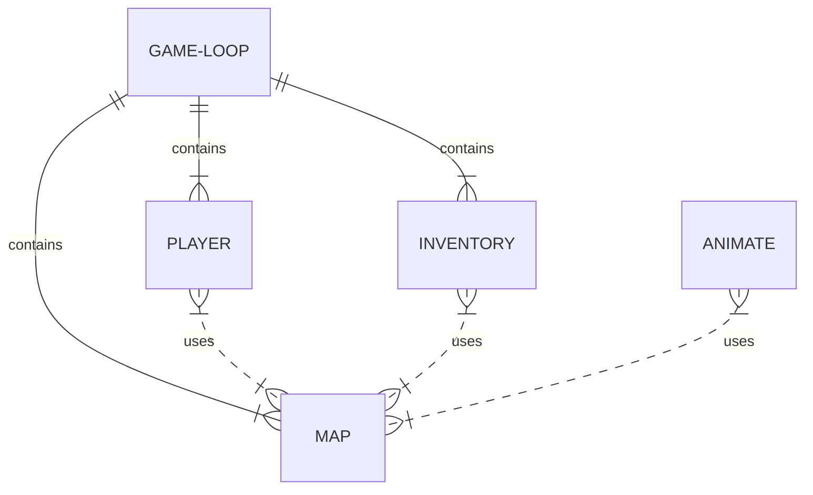

Team Silver Snakes *ssss* *sssss* *sssss*
1. Introduction
  Team Silver Snakes is working on a RPG game developed on the PICO-8 Platform. PICO-8 is a IDE/game engine that uses the lua language to create 8-bit retro style game. Our aim is to develop a game that allows the user to move throughout a medieval style environment, fight monsters, increase player stats through items, and reach an end goal which would cause the end of the game. 

1.1 Purpose of Product

  A simple RPG game developed in Pico-8 that allows the user to explore a created world, fight monsters, and complete a set of tasks to end the game. The end result should be simple, interesting, and fun. 

1.2 Scope of Product
 
  This will be a short game that focuses on mechanic competency over length and complexity. We hope to allow a player to move and interact with the world, pick up items, and fight monsters to reach the end of the game. We will create conditions for the player to win the game, lose by taking damage, and modify character stats. This will not be an 8-bit version of Skyrim. 

1.3 Acronyms, Abbreviations, Definitions
  Pico-8 refers to the development platform we are using.

2. General Description of Product and Product Functions
  As stated above, the overall purpose of our game is simple fun. We are aiming to have an engaging player experience, mechanically and visually while still maintaining simple fun. Our game, working title is Silver Snake, should allow the player to explore a simple 8-bit medieval style world. The player will be able to interact with non-player characters for dialogue, fight monsters that appear in the world (a combination of button pressing and proximity fighting using an input key), and reach an end state of the game, which will likely require defeating a boss and reaching a zone that triggers a game winning event. The player can also "lose" and retry the game. The player character will have a health bar, and lose health while fighting enemies, or due to environmental hazards. 

2.1 Context of Product
  This game will exist in the smaller ecosystem of home-brewed PICO-8 cartridges (games) that exist online and amongst the PICO-8 development community. 

2.2 User Characteristics and Expectations
  We don't expect much of our users. Our users should be able to use a keyboard/mouse and have a elementary school reading comprehension to play the game. We aren't expecting to implement the next Elden Ring and require pros to navigate our 8-bit hellscape. 

2.3 Constraints
  Our team is limited by core development knowledge on the PICO-8 platform, and development of games in general. While the PICO-8 platform has limitations such as restraints on the amount of tokens that can exist in a game, or the overall size of the program and its operating capacity, we don't expect to run into these issues. Our team will struggle with effectively implementing the system we have described. However we believe we are up to the challenge and excited to learn a new system, even if it is just for fun. 

3. Functional Requirements
  In a standard requirements document, you would have a LONG list of functional requirements here. You should put a link to your user story page here.

4. System and Non-functional Requirements
4.1 External Interface Requirements (User,Hardware,Software,Communications)
Our system will run out of a browser engine and will be contain a start menu and then launch directly into the game. There will be no other menus or changes of environment outside of the game itself running. There will be a brief message in the beginning of the game telling the player what controls to use, and the Esc key will allow the player to stop or restart the card. 

4.1 Performance Requirements
Our game will run inside any web browser. If your system can have more than 5 chrome tabs open you won't have any issue running our game. 

4.2 Design Constraints
Our biggest design constraint is overall scope/time in this class. We are a team of 4 people with no game development experience, developing on a platform we have no experience in, and we have never worked together before. Time is the biggest factor that is limiting our ability to make this game into a very large/involved piece of software.

4.3 Quality Requirements
Our users are just expecting something that is playable, that has clear goals, obvious affordances, and a win/lose condition that makes sense. 

